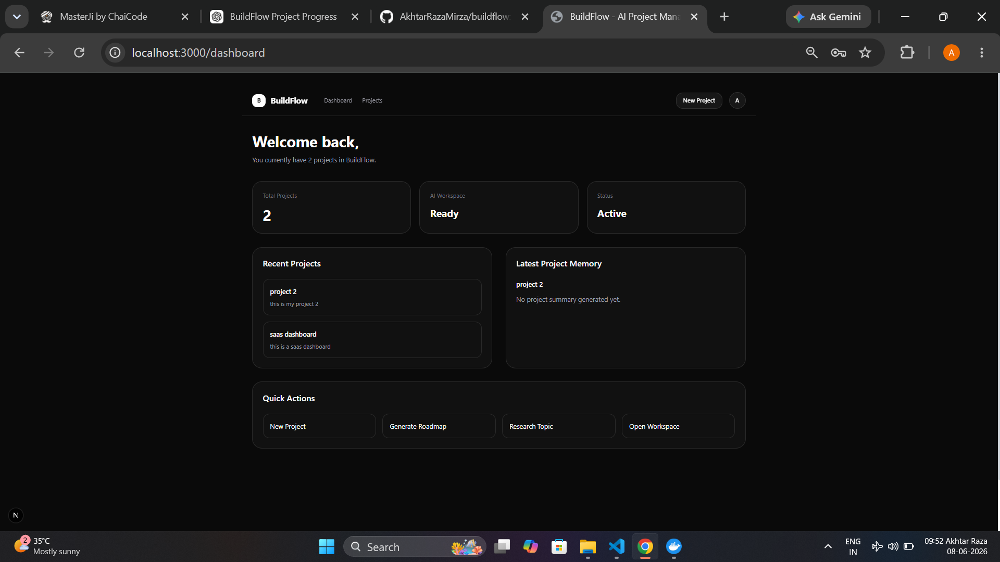
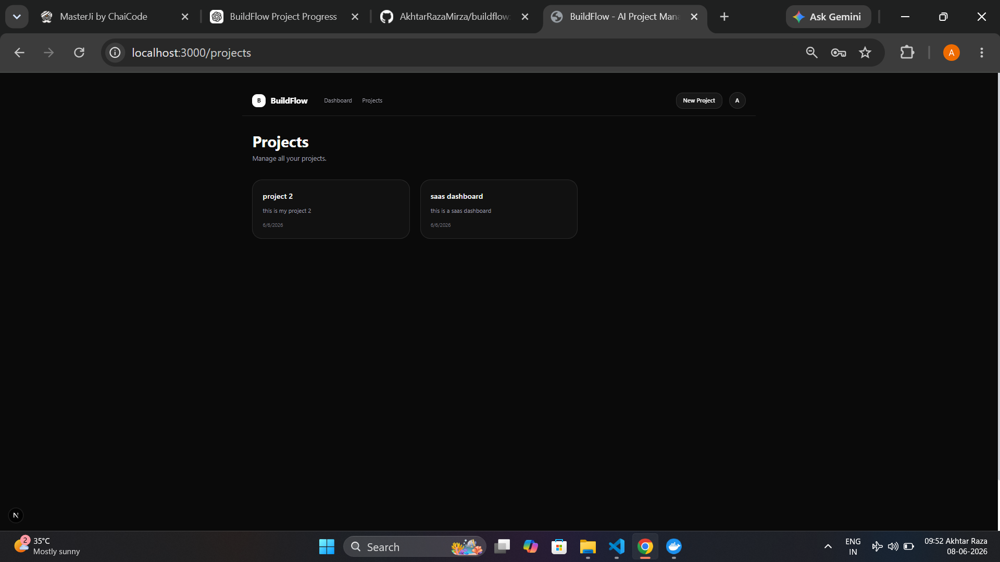
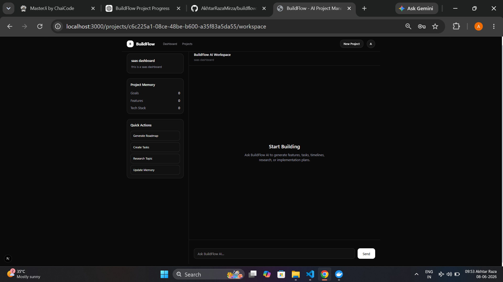
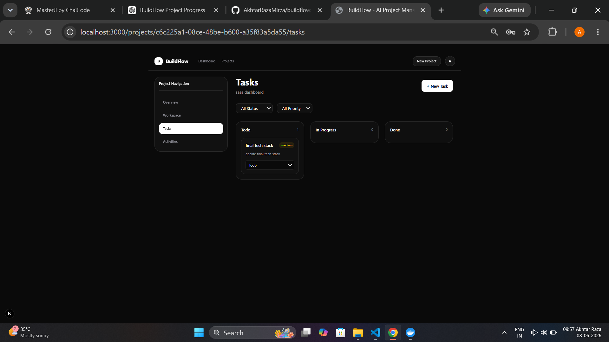
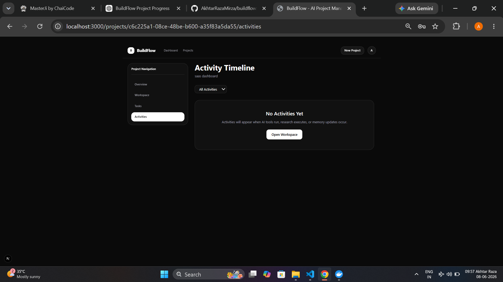

# BuildFlow

BuildFlow is an AI-powered project management platform that helps turn ideas into structured execution plans.

Instead of managing projects manually, users can collaborate with AI to generate roadmaps, create tasks, research topics, maintain project memory, and track project activity from a single workspace.

## Why I Built This

I wanted to build a project that combined traditional project management with AI workflows.

Most AI tools can generate content, but they don't help organize and manage an entire project. BuildFlow was my attempt to solve that problem by creating a workspace where AI can assist with planning, research, task generation, and project organization.

This project was also built to deepen my understanding of:

* Full-stack development
* AI integrations
* Agentic workflows
* PostgreSQL databases
* Modern deployment workflows

## Features

* User authentication
* Project creation and management
* AI-powered workspace
* Roadmap generation
* Task generation and tracking
* Research assistance
* Project memory system
* Activity timeline
* Responsive dashboard
* Loading, empty, and error states

## Tech Stack

### Frontend

* Next.js 15
* TypeScript
* Tailwind CSS

### Backend

* Express.js
* TypeScript
* PostgreSQL
* Drizzle ORM

### AI

* Groq
* Tavily

### Deployment

* Vercel
* Render

## Architecture

Client (Next.js)
        ↓
Express API
        ↓
PostgreSQL Database
        ↓
AI Services (Groq + Tavily)

## Live Demo

Frontend:
https://buildflow.akhtarraza.in

Backend API:
https://buildflow-api.akhtarraza.in

Repository:
https://github.com/AkhtarRazaMirza/buildflow

## Screenshots

### Dashboard



### Projects



### AI Workspace



### Tasks



### Activities



## Running Locally

### Clone the repository

```bash
git clone https://github.com/AkhtarRazaMirza/buildflow.git
cd buildflow
```

### Frontend

```bash
cd client
npm install
npm run dev
```

### Backend

```bash
cd server
npm install
npm run dev
```

### Environment Variables

Create a `.env` file inside the server folder:

```env
DATABASE_URL=
JWT_SECRET=
GROQ_API_KEY=
TAVILY_API_KEY=
```

## Future Improvements

* Drag and drop task management
* Rich markdown support in chat
* Project templates
* Team collaboration
* AI-generated project reports
* File uploads

## Current Version

v1.0.0

## What I Learned

Building BuildFlow taught me a lot about designing full-stack applications that combine AI capabilities with traditional software architecture.

The biggest challenge was connecting AI-generated outputs with persistent project data while keeping the user experience simple and intuitive.

## Author

Akhtar Raza

GitHub:
https://github.com/AkhtarRazaMirza

Portfolio:
https://akhtarraza.in

Built as a portfolio project while learning modern full-stack and AI application development.
